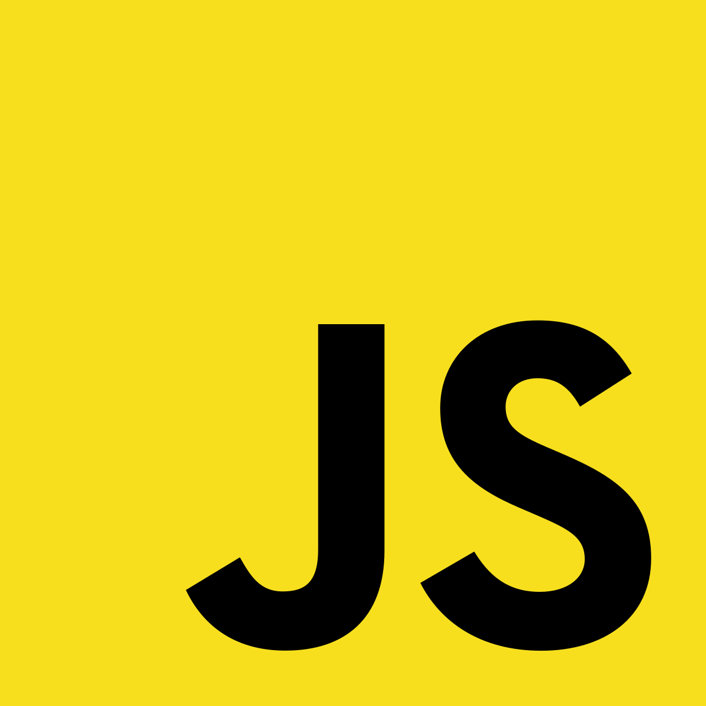
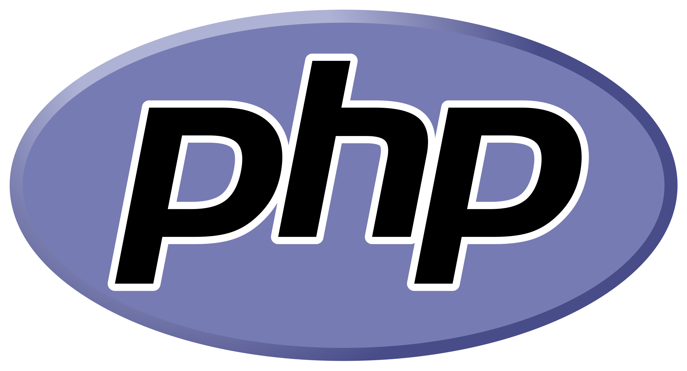

</img>

<h1 style = "text-align: center; margin-top: 25px"> Hello there, je suis William Rodriguez</h1>

<h2 style = "text-align: center"> Je suis actuellement étudiant à l'IIM</h2>

## Je suis actuellement étudiant à l'IIM

# Compétences:

</img>
</img>
</img>
</img>

<!--
**RzWilliam/RzWilliam** is a ✨ _special_ ✨ repository because its `README.md` (this file) appears on your GitHub profile.

Here are some ideas to get you started:

- 🔭 I’m currently working on ...
- 🌱 I’m currently learning ...
- 👯 I’m looking to collaborate on ...
- 🤔 I’m looking for help with ...
- 💬 Ask me about ...
- 📫 How to reach me: ...
- 😄 Pronouns: ...
- ⚡ Fun fact: ...
-->